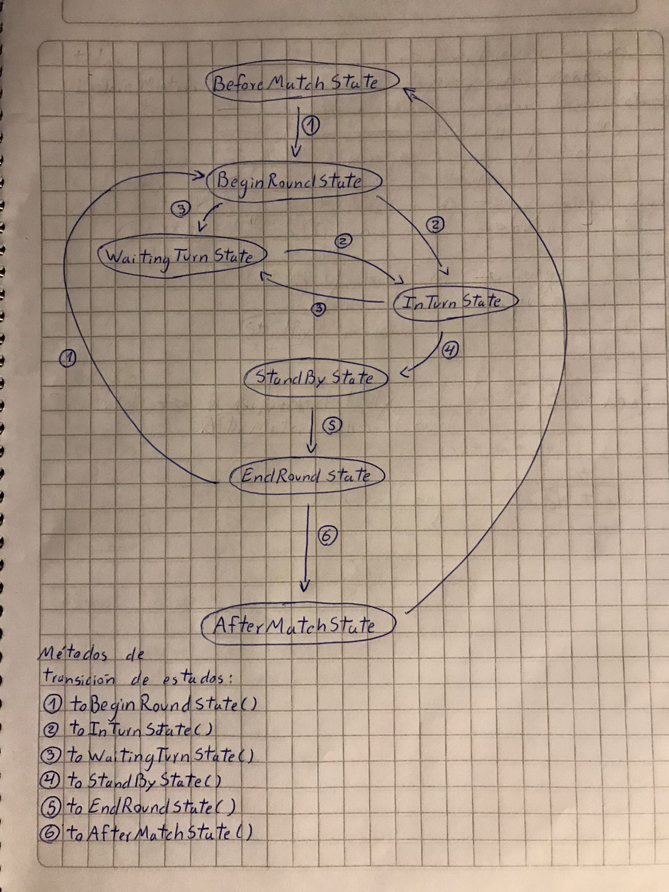

# Gwen't

This work is licensed under a
[Creative Commons Attribution 4.0 International License](http://creativecommons.org/licenses/by/4.0/)

Context
-------

This project's goal is to create a (simplified) clone of the
[_Gwent_](https://www.playgwent.com/en)card game developed by [_CD PROJEKT RED_](https://cdprojektred.com/en/)

---

**The rest of the documentation is left for the users of this template to complete**

## Resume
The following code it´s divided in 4 principals parts: Cards,
Players, Board and States.

## Cards
Here, in the package cards, are all cards played in the game
with their respective categories either as a class or a trait,
also includes classes for the abilities and effects the cards could
have.

## Players
Here, in the package players, are both player classes (human and cpu)
also include their trait and the implementation of the common
methods (in the abstract class)

## Board
Here, in the package board, are all class and traits that represents the Board of 
the game, a BoardSection for each player and a Board that
encapsulate two BoardSections, also includes CardLibrary with all cards
that can be use in the game.

## States
In this part of the code, there are all states of the game
used in the GameController, the states divisions are:
- BeforeMatchState: Here the controller choose the name of the human player,
build the deck for the match and prepares the Board to use.
- BeginRoundState: Start a round choosing which player goes first.
- InTurnState: The human player either choose to play a card or pass the round.
- WaitingTurnState: Formally it´s the state that represents the machine turn to play.
- StandByState: A transitory state between the human player pass and the end of the round.
- EndRoundState: Formally ends a round, count scores and clean the Board.
- AfterMatchState: Here it´s decided the winner and proceeds to begin a new match.
## Diagrama de estados

